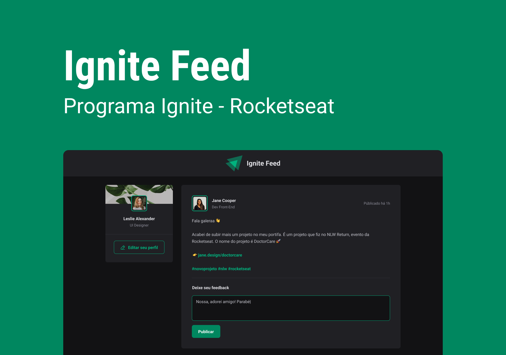

<div align="center">
  
</div>

<h3 align="center">Jakeliny - Ignite Feed</h3>


<p align="center">
  <a href="#about">Sobre</a>&nbsp;&nbsp;&nbsp;|&nbsp;&nbsp;&nbsp;
  <a href="#install">Instalação</a>&nbsp;&nbsp;&nbsp;|&nbsp;&nbsp;&nbsp;
  <a href="#challenge">Desafios</a>&nbsp;&nbsp;&nbsp;|&nbsp;&nbsp;&nbsp;
  <a href="#technologies">Tecnologias</a>
</p>

<div align="center"></div>

<br>

## :speech_balloon: Sobre <a name="about"></a>
> O Ignite Feed é um projeto desenvolvido com o objetivo de praticar alguns conceitos bem importantes do Reactjs. Como estado, imutabilidade, propriedades, componentes e iteração.
> 1º Projeto do Bootcamp Ignite @Rocketseat. É o lado do cliente de um feed de uma rede social, com posts, comentários e curtidas. Para aprender os conceitos principais do React e TypeScript.

## :computer: Funcionalidades

- Publicar um comentário,
- Dar likes(Aplaudir) em um comentário,
- Remover/Apagar comentário,

## :rocket: Tecnologias <a name="technologies"></a>

- [Vite](https://vitejs.dev/)
- [React](https://pt-br.reactjs.org/)
- [TypeScript](https://www.typescriptlang.org/)
- [Node e NPM](https://nodejs.org/)
- [Phosphor Icons](https://phosphoricons.com/)
- [Date-Fns](https://date-fns.org/)
- [Figma](https://www.figma.com/)

<div>
  
  
  
  
</div>

## :warning: Instalação <a name="install"></a>

# Run this project
1. Clone this repository
    ```
    git clone https://github.com/jakeliny/ignite-feed.git
    ```

```bash
# Instalar as dependências necessárias:
$ npm install

# Iniciar o projeto:
$ npm run dev
```
